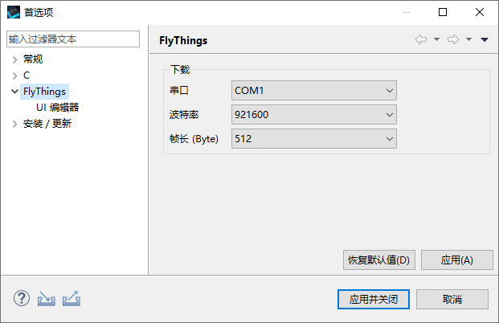

# 下载程序到MCU

1. 保持电脑与MCU串口正常连接。
2. 找到软件顶部的菜单栏，依次选择`窗口`->`首选项`->`FlyThings Lite`     
   在`下载`选项组中，选择与MCU连接的串口。   
   尽量选择MCU能支持的最高波特率，这将有效缩短下载时间。  
   其他保持默认。
3. 设置完成后，点击`应用并关闭`保存设置。  
   
      

4. 在`项目资源管理器`中，选中想要下载的项目名，右键，在弹出的菜单中，选择`下载到MCU`。   
   软件右下角提示正在编译，几秒钟后，自动弹出下载程序，如果一切正常，将看到下载进度。   
   如果下载程序提示超时，请确认串口连接情况，以及MCU是否正常开机。

  

