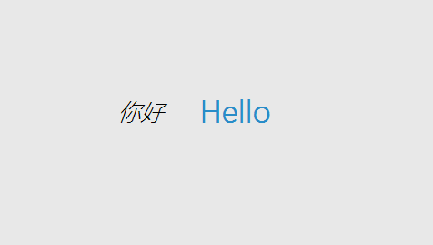

# 静态标签

该控件可用于展示一段固定的文字。  
优点是不限制字体、不限大小，不限颜色。  
缺点是文字内容无法使用代码动态修改。
## 属性
* 文字   
  设置显示的内容。
* 字体   
  设置文字的字体，可选择电脑系统中的所有字体。
* 字体大小   
  设置字体的大小。
* 文字颜色   
  设置文字的颜色。
* 背景色   
  设置整个控件矩形区域的背景色。
* 风格   
  设置文字粗体或者斜体风格。
  
## 效果展示

